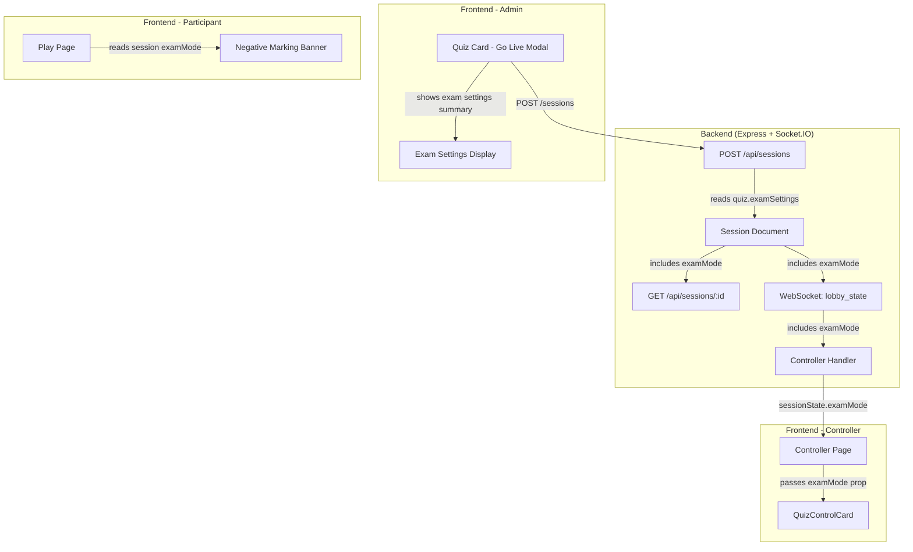

# Design Document: Missing UI Wiring

## Overview

This design addresses the disconnection between existing backend data models and frontend UI components for exam mode and tournament features in CTX Quiz. The core issue is that quiz-level exam settings (`QuizExamSettings`) are never propagated to session-level exam mode configuration (`ExamModeConfig`) during session creation, and the controller panel hardcodes `examMode` to `null`. Additionally, participants are never informed about negative marking, and tournament page accessibility needs verification.

The fix is surgical: modify the session creation endpoint to map `Quiz.examSettings` → `Session.examMode`, update API responses to include `examMode`, wire the controller panel to read `examMode` from session state, add a negative marking warning banner to the participant app, and update the Go Live modal to show exam settings.

All data models already exist. No new database collections or WebSocket events are needed.

## Architecture

The changes span three layers of the existing architecture:



### Data Flow for Exam Mode

1. Admin creates quiz with `examSettings` via quiz form (already works)
2. Admin clicks "Go Live" → modal shows exam settings summary (new)
3. Admin confirms → `POST /api/sessions` creates session with `examMode` populated from `quiz.examSettings` (fix)
4. Session creation response includes `examMode` (fix)
5. Controller connects → `getCurrentSessionState` returns `examMode` from MongoDB (fix)
6. `lobby_state` broadcast includes `examMode` (fix)
7. Controller page reads `examMode` from session state, passes to `QuizControlCard` (fix)
8. Participant joins → session state includes `examMode` → warning banner shown (new)

## Components and Interfaces

### 1. Session Creation Endpoint (`POST /api/sessions`)

**File:** `backend/src/routes/session.routes.ts`

**Current behavior:** Creates session with only `quizId`, ignores `quiz.examSettings`.

**New behavior:** After fetching the quiz, map `quiz.examSettings` to `session.examMode`:

```typescript
// After quiz is fetched and validated
function mapExamSettingsToExamMode(
  examSettings?: QuizExamSettings
): ExamModeConfig | undefined {
  if (!examSettings) return undefined;
  if (!examSettings.negativeMarkingEnabled && !examSettings.focusMonitoringEnabled) {
    return undefined;
  }
  return {
    skipRevealPhase: false,
    negativeMarkingEnabled: examSettings.negativeMarkingEnabled,
    negativeMarkingPercentage: examSettings.negativeMarkingPercentage,
    focusMonitoringEnabled: examSettings.focusMonitoringEnabled,
    autoAdvance: false,
  };
}
```

The session document construction adds:
```typescript
const session: Session = {
  // ...existing fields...
  examMode: mapExamSettingsToExamMode(quiz.examSettings),
};
```

The creation response includes `examMode`:
```typescript
res.status(201).json({
  success: true,
  session: {
    // ...existing fields...
    examMode: session.examMode,
  },
  quiz: { /* ...existing fields... */ },
});
```

### 2. Session GET Endpoint (`GET /api/sessions/:sessionId`)

**File:** `backend/src/routes/session.routes.ts`

**Current behavior:** Returns session data but does not include `examMode`.

**New behavior:** Include `examMode` in the session response object:

```typescript
const sessionData = {
  // ...existing fields...
  examMode: session.examMode || null,
};
```

### 3. Controller WebSocket State

**File:** `backend/src/websocket/controller.handler.ts`

**`getCurrentSessionState`** currently returns `{ state, currentQuestionIndex, participantCount }`. It needs to also return `examMode` when falling back to MongoDB:

```typescript
async function getCurrentSessionState(sessionId: string): Promise<{
  state: string;
  currentQuestionIndex: number;
  participantCount: number;
  examMode?: ExamModeConfig;
  // ...existing optional fields...
}> {
  // ...existing Redis fast path...
  // MongoDB fallback adds:
  return {
    state: session.state,
    currentQuestionIndex: session.currentQuestionIndex,
    participantCount: session.participantCount,
    examMode: session.examMode,
  };
}
```

**`broadcastLobbyStateToController`** in `broadcast.service.ts` needs to include `examMode` in the lobby state payload:

```typescript
const lobbyStatePayload = {
  // ...existing fields...
  examMode: session.examMode || null,
};
```

### 4. Controller Socket Hook (Frontend)

**File:** `frontend/src/hooks/useControllerSocket.ts`

**`ControllerSessionState`** interface already has no `examMode` field. Add it:

```typescript
export interface ControllerSessionState {
  // ...existing fields...
  examMode?: ExamModeConfig | null;
}
```

Update the `lobby_state` handler to capture `examMode`:

```typescript
socket.on('lobby_state', (data) => {
  setSessionState((prev) => ({
    ...prev!,
    // ...existing fields...
    examMode: data.examMode ?? prev?.examMode ?? null,
  }));
});
```

Update the `authenticated` handler similarly to capture `examMode` from `currentState` if it's an object.

### 5. Controller Page

**File:** `frontend/src/app/controller/[sessionId]/page.tsx`

Replace `examMode={null}` with actual session state:

```typescript
<QuizControlCard
  // ...existing props...
  examMode={sessionState?.examMode ?? null}
/>
```

### 6. Go Live Modal (Quiz Card)

**File:** `frontend/src/app/admin/components/quiz-card.tsx`

The `Quiz` interface needs `examSettings`:

```typescript
export interface Quiz {
  // ...existing fields...
  examSettings?: {
    negativeMarkingEnabled: boolean;
    negativeMarkingPercentage: number;
    focusMonitoringEnabled: boolean;
  };
}
```

In the modal, before the "Start Session" button, show exam settings summary when configured:

```tsx
{quiz.examSettings && (quiz.examSettings.negativeMarkingEnabled || quiz.examSettings.focusMonitoringEnabled) && (
  <div className="neu-pressed rounded-lg p-4">
    <p className="text-caption text-[var(--text-muted)] mb-2">Exam Settings</p>
    {quiz.examSettings.negativeMarkingEnabled && (
      <div className="flex items-center justify-between text-body-sm">
        <span className="text-[var(--text-muted)]">Negative Marking</span>
        <span className="font-medium text-warning">{quiz.examSettings.negativeMarkingPercentage}% deduction</span>
      </div>
    )}
    {quiz.examSettings.focusMonitoringEnabled && (
      <div className="flex items-center justify-between text-body-sm mt-1">
        <span className="text-[var(--text-muted)]">Focus Monitoring</span>
        <span className="font-medium text-info">Enabled</span>
      </div>
    )}
  </div>
)}
```

### 7. Participant Negative Marking Banner

**File:** `frontend/src/app/play/[sessionId]/page.tsx`

The participant socket hook's session state needs to expose `examMode`. The `useParticipantSocket` hook receives session data on connection. The play page reads `examMode` from session state and renders a warning banner:

```tsx
{sessionState?.examMode?.negativeMarkingEnabled && (
  <div className="w-full bg-warning/10 border border-warning/30 rounded-lg p-3 mb-4">
    <p className="text-body-sm text-warning-dark font-medium text-center">
      ⚠️ Negative marking is active — {sessionState.examMode.negativeMarkingPercentage}% deduction for wrong answers
    </p>
  </div>
)}
```

This banner appears in the lobby screen and during active questions.

## Data Models

No new data models are needed. All types already exist:

### Existing Types Used

```typescript
// backend/src/models/types.ts - Already defined
interface QuizExamSettings {
  negativeMarkingEnabled: boolean;
  negativeMarkingPercentage: number; // 5-100
  focusMonitoringEnabled: boolean;
}

interface ExamModeConfig {
  skipRevealPhase: boolean;
  negativeMarkingEnabled: boolean;
  negativeMarkingPercentage: number;
  focusMonitoringEnabled: boolean;
  autoAdvance: boolean;
}

// Session already has: examMode?: ExamModeConfig
// Quiz already has: examSettings?: QuizExamSettings
```

### Mapping Relationship

| QuizExamSettings field | ExamModeConfig field | Default |
|---|---|---|
| `negativeMarkingEnabled` | `negativeMarkingEnabled` | direct copy |
| `negativeMarkingPercentage` | `negativeMarkingPercentage` | direct copy |
| `focusMonitoringEnabled` | `focusMonitoringEnabled` | direct copy |
| (not in quiz settings) | `skipRevealPhase` | `false` |
| (not in quiz settings) | `autoAdvance` | `false` |


## Correctness Properties

*A property is a characteristic or behavior that should hold true across all valid executions of a system — essentially, a formal statement about what the system should do. Properties serve as the bridge between human-readable specifications and machine-verifiable correctness guarantees.*

### Property 1: Exam settings round-trip consistency

*For any* valid `QuizExamSettings` object (with `negativeMarkingEnabled`, `negativeMarkingPercentage` between 5-100, and `focusMonitoringEnabled`), calling `mapExamSettingsToExamMode` SHALL produce an `ExamModeConfig` where:
- `negativeMarkingEnabled` equals the input's `negativeMarkingEnabled`
- `negativeMarkingPercentage` equals the input's `negativeMarkingPercentage`
- `focusMonitoringEnabled` equals the input's `focusMonitoringEnabled`
- `skipRevealPhase` is `false`
- `autoAdvance` is `false`

And when `examSettings` is `undefined` or both `negativeMarkingEnabled` and `focusMonitoringEnabled` are `false`, the function SHALL return `undefined`.

**Validates: Requirements 1.1, 1.2, 1.3, 1.4, 1.5, 5.1, 5.2**

### Property 2: Negative marking banner displays percentage

*For any* `negativeMarkingPercentage` value between 5 and 100, when the participant app renders a session with `examMode.negativeMarkingEnabled` set to `true` and that percentage, the warning banner text SHALL contain the percentage value as a string.

**Validates: Requirements 4.1, 4.2**

## Error Handling

### Session Creation with Missing Quiz

If the quiz referenced by `quizId` does not exist, the endpoint already returns a 404 error. No change needed. The `examSettings` mapping only runs after the quiz is successfully fetched.

### Malformed ExamSettings on Quiz Document

If a quiz document in MongoDB has a malformed `examSettings` field (e.g., missing `negativeMarkingPercentage`), the mapping function should treat it as if `examSettings` is undefined and not set `examMode` on the session. The mapping function should use optional chaining and default to `undefined` for safety.

### Controller Receives Session Without ExamMode

When `getCurrentSessionState` returns no `examMode` (session created before this fix, or quiz had no exam settings), the controller page already handles this by passing `null` to `QuizControlCard`. The `?? null` fallback ensures backward compatibility.

### Participant App Without ExamMode in Session State

When `sessionState.examMode` is `undefined` or `null`, the conditional rendering `{sessionState?.examMode?.negativeMarkingEnabled && ...}` evaluates to falsy and the banner is not shown. No error occurs.

## Testing Strategy

### Property-Based Testing

- **Library:** fast-check (already in project dependencies)
- **Minimum iterations:** 100 per property test
- **Location:** `backend/src/routes/__tests__/exam-mode-mapping.test.ts` for Property 1, `frontend/src/app/play/__tests__/negative-marking-banner.test.tsx` for Property 2

**Property 1 test approach:**
Generate random `QuizExamSettings` objects using fast-check arbitraries:
- `negativeMarkingEnabled`: `fc.boolean()`
- `negativeMarkingPercentage`: `fc.integer({ min: 5, max: 100 })`
- `focusMonitoringEnabled`: `fc.boolean()`

Assert the mapping function output matches the expected `ExamModeConfig` or `undefined`.

**Tag:** `Feature: missing-ui-wiring, Property 1: Exam settings round-trip consistency`

**Property 2 test approach:**
Generate random percentage values using `fc.integer({ min: 5, max: 100 })`. Render the warning banner component with that percentage and assert the rendered text contains the percentage string.

**Tag:** `Feature: missing-ui-wiring, Property 2: Negative marking banner displays percentage`

### Unit Testing

Unit tests complement property tests for specific examples and edge cases:

- **Mapping function edge cases:** `undefined` input, both settings disabled, only one enabled
- **API response shape:** Verify `examMode` is included in POST and GET responses
- **Controller wiring:** Verify `examMode` is passed from session state to `QuizControlCard` prop
- **Go Live modal:** Verify exam settings section renders/hides based on quiz settings
- **Participant banner:** Verify banner shows/hides based on `examMode.negativeMarkingEnabled`
- **Tournament pages:** Verify pages render without errors and fetch data from API
