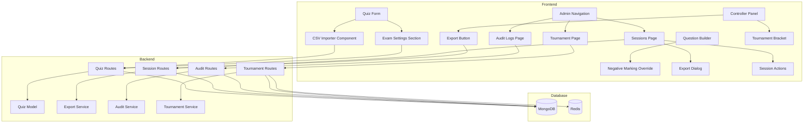

# Design Document: Quiz Platform Enhancements

## Overview

This design document details the technical implementation for seven major enhancements to the CTX Quiz platform:

1. **CSV Bulk Import** - Frontend CSV parser with validation, preview UI, and template generation
2. **Negative Marking UI** - Quiz Form and Question Builder UI extensions for exam settings
3. **Multi-Round Tournament Mode** - New tournament data model, progression logic, and bracket visualization
4. **Quiz Results Export UI** - Export buttons and format selection dialogs in Controller and Admin panels
5. **Audit Log Viewer** - Admin page with filtering, pagination, and detail expansion
6. **Session Management UI** - Enhanced sessions page with filters, actions, and auto-refresh
7. **Test Database Isolation** - Jest configuration for separate test database connections

The design follows existing architectural patterns:
- Frontend: Next.js 14 App Router, React Query for data fetching, Zustand for state, Tailwind CSS with neumorphic design
- Backend: Express.js REST API, MongoDB for persistence, Redis for caching
- Testing: Jest with fast-check for property-based testing

## Architecture



## Components and Interfaces

### 1. CSV Bulk Import

#### CSV Template Structure

```csv
# CTX Quiz Question Import Template
# Lines starting with # are comments and will be ignored
# Required columns: question_text, question_type, correct_options
# Optional columns: option_a through option_f, time_limit, base_points, speed_bonus_enabled, speed_bonus_multiplier, shuffle_options, explanation, image_url
#
# question_type values: MULTIPLE_CHOICE, MULTI_SELECT, TRUE_FALSE, SCALE_1_10, NUMBER_INPUT
# correct_options: For MULTI_SELECT, separate multiple answers with semicolons (e.g., "A;C")
# time_limit: 5-120 seconds (default: 30)
# base_points: 100-10000 (default: 1000)
# speed_bonus_enabled: true/false (default: true)
# speed_bonus_multiplier: 0.1-2.0 (default: 0.5)
# shuffle_options: true/false (default: true)
#
question_text,question_type,option_a,option_b,option_c,option_d,correct_options,time_limit,base_points,speed_bonus_enabled,speed_bonus_multiplier,shuffle_options,explanation,image_url
"What is 2+2?",MULTIPLE_CHOICE,"3","4","5","6",B,30,1000,true,0.5,true,"Basic arithmetic",
"Select all prime numbers",MULTI_SELECT,"2","4","5","9","A;C",45,1500,true,0.5,false,"2 and 5 are prime",
"The Earth is flat",TRUE_FALSE,"True","False",,,"B",20,500,false,,true,"Scientific fact",
```

#### CSVImporter Component Interface

```typescript
// frontend/src/app/admin/quiz/components/csv-importer.tsx

interface CSVColumn {
  name: string;
  required: boolean;
  validator: (value: string) => ValidationResult;
}

interface ValidationResult {
  isValid: boolean;
  error?: string;
}

interface ParsedQuestion {
  rowNumber: number;
  data: Partial<QuestionFormData>;
  isValid: boolean;
  errors: { column: string; message: string }[];
}

interface CSVImporterProps {
  onImport: (questions: QuestionFormData[]) => void;
  onCancel: () => void;
  existingQuestionCount: number;
}

interface CSVImporterState {
  file: File | null;
  parsedQuestions: ParsedQuestion[];
  isLoading: boolean;
  parseError: string | null;
}
```

#### CSV Parser Service

```typescript
// frontend/src/lib/csv-parser.ts

interface CSVParserConfig {
  columns: CSVColumn[];
  skipCommentLines: boolean;
  trimValues: boolean;
}

interface ParseResult {
  questions: ParsedQuestion[];
  totalRows: number;
  validRows: number;
  invalidRows: number;
}

function parseCSV(content: string, config: CSVParserConfig): ParseResult;
function generateTemplate(): string;
function downloadTemplate(): void;
```

### 2. Negative Marking UI

#### Quiz Form Extension

```typescript
// Extension to frontend/src/app/admin/quiz/components/quiz-form.tsx

interface ExamSettings {
  negativeMarkingEnabled: boolean;
  negativeMarkingPercentage: number; // 5-100, default 25
  focusMonitoringEnabled: boolean;
}

interface QuizFormData {
  // Existing fields...
  title: string;
  description: string;
  quizType: QuizType;
  branding: QuizBranding;
  
  // New exam settings
  examSettings: ExamSettings;
}
```

#### Question Builder Extension

```typescript
// Extension to frontend/src/app/admin/quiz/components/question-builder.tsx

interface QuestionScoringOverride {
  // Existing fields...
  basePoints: number;
  speedBonusEnabled: boolean;
  speedBonusMultiplier: number;
  partialCreditEnabled: boolean;
  
  // New negative marking override
  negativeMarkingOverride?: {
    enabled: boolean;
    percentage: number; // 0-100
  };
}
```

### 3. Multi-Round Tournament Mode

#### Tournament Data Model

```typescript
// backend/src/models/types.ts

interface Tournament {
  _id: ObjectId;
  tournamentId: string;
  title: string;
  description: string;
  branding: QuizBranding;
  
  rounds: TournamentRound[];
  progressionRules: ProgressionRules;
  
  state: TournamentState;
  currentRoundIndex: number;
  
  createdAt: Date;
  startedAt?: Date;
  endedAt?: Date;
  hostId: string;
}

interface TournamentRound {
  roundNumber: number;
  quizId: ObjectId;
  sessionId?: string;
  
  qualifiedParticipants: string[]; // participantIds who can join this round
  state: 'PENDING' | 'ACTIVE' | 'COMPLETED';
  
  startedAt?: Date;
  endedAt?: Date;
}

interface ProgressionRules {
  type: 'TOP_N' | 'TOP_PERCENTAGE';
  value: number; // N participants or X%
  scoreCarryOver: boolean; // Whether scores carry to next round
}

type TournamentState = 'DRAFT' | 'LOBBY' | 'IN_PROGRESS' | 'COMPLETED';
```

#### Tournament Service

```typescript
// backend/src/services/tournament.service.ts

class TournamentService {
  async createTournament(data: CreateTournamentRequest): Promise<Tournament>;
  async addRound(tournamentId: string, quizId: string): Promise<TournamentRound>;
  async startTournament(tournamentId: string): Promise<Tournament>;
  async startRound(tournamentId: string, roundNumber: number): Promise<TournamentRound>;
  async endRound(tournamentId: string, roundNumber: number): Promise<TournamentRound>;
  async calculateAdvancingParticipants(tournamentId: string, roundNumber: number): Promise<string[]>;
  async getTournamentBracket(tournamentId: string): Promise<TournamentBracket>;
}
```

### 4. Quiz Results Export UI

#### Export Dialog Component

```typescript
// frontend/src/components/export-dialog.tsx

interface ExportDialogProps {
  isOpen: boolean;
  onClose: () => void;
  sessionId: string;
  quizTitle: string;
}

type ExportFormat = 'csv' | 'json';

interface ExportOptions {
  format: ExportFormat;
  includeAnswerDetails: boolean;
  includeTimestamps: boolean;
}
```

#### Export Service Integration

```typescript
// frontend/src/lib/api-client.ts

async function exportSessionResults(
  sessionId: string, 
  format: ExportFormat
): Promise<Blob>;

function triggerDownload(blob: Blob, filename: string): void;
```

### 5. Audit Log Viewer

#### Audit Log Page Component

```typescript
// frontend/src/app/admin/audit-logs/page.tsx

interface AuditLogFilters {
  sessionId?: string;
  eventType?: ExtendedAuditEventType[];
  startDate?: Date;
  endDate?: Date;
}

interface AuditLogEntry {
  _id: string;
  eventType: ExtendedAuditEventType;
  sessionId?: string;
  participantId?: string;
  quizId?: string;
  userId?: string;
  details: Record<string, unknown>;
  errorMessage?: string;
  timestamp: Date;
}

interface PaginationState {
  page: number;
  limit: number;
  total: number;
  totalPages: number;
}
```

### 6. Session Management UI

#### Enhanced Sessions Page

```typescript
// frontend/src/app/admin/sessions/page.tsx

interface SessionFilters {
  status: SessionState | 'ALL';
  startDate?: Date;
  endDate?: Date;
  searchQuery?: string;
}

interface SessionActions {
  openController: (sessionId: string) => void;
  openBigScreen: (sessionId: string) => void;
  endSession: (sessionId: string) => Promise<void>;
  viewResults: (sessionId: string) => void;
  exportResults: (sessionId: string) => void;
  deleteSession: (sessionId: string) => Promise<void>;
}
```

### 7. Test Database Isolation

#### Jest Configuration Updates

```typescript
// backend/jest.setup.js

// Test database configuration
const TEST_MONGODB_URI = process.env.TEST_MONGODB_URI || 
  'mongodb://localhost:27017/quiz_platform_test';
const TEST_REDIS_DB = process.env.TEST_REDIS_DB || 15; // Use Redis DB 15 for tests

// Override environment variables for tests
process.env.MONGODB_URI = TEST_MONGODB_URI;
process.env.REDIS_DB = TEST_REDIS_DB.toString();

// Global setup: Connect to test database
beforeAll(async () => {
  await connectToTestDatabase();
});

// Global teardown: Clean up and disconnect
afterAll(async () => {
  await cleanupTestData();
  await disconnectFromTestDatabase();
});
```

## Data Models

### Quiz Model Extension

```typescript
// backend/src/models/types.ts

interface Quiz {
  // Existing fields...
  _id: ObjectId;
  title: string;
  description: string;
  quizType: QuizType;
  branding: QuizBranding;
  questions: Question[];
  
  // New exam settings
  examSettings?: {
    negativeMarkingEnabled: boolean;
    negativeMarkingPercentage: number;
    focusMonitoringEnabled: boolean;
  };
  
  createdAt: Date;
  updatedAt: Date;
}
```

### Question Model Extension

```typescript
interface Question {
  // Existing fields...
  questionId: string;
  questionText: string;
  questionType: QuestionType;
  options: Option[];
  scoring: ScoringConfig;
  
  // New negative marking override
  negativeMarkingOverride?: {
    enabled: boolean;
    percentage: number;
  };
}
```

### Tournament Collection Schema

```typescript
// MongoDB collection: tournaments

{
  _id: ObjectId,
  tournamentId: string,           // UUID
  title: string,
  description: string,
  branding: {
    primaryColor: string,
    secondaryColor: string,
    logoUrl?: string
  },
  rounds: [
    {
      roundNumber: number,
      quizId: ObjectId,
      sessionId?: string,
      qualifiedParticipants: string[],
      state: 'PENDING' | 'ACTIVE' | 'COMPLETED',
      startedAt?: Date,
      endedAt?: Date
    }
  ],
  progressionRules: {
    type: 'TOP_N' | 'TOP_PERCENTAGE',
    value: number,
    scoreCarryOver: boolean
  },
  state: 'DRAFT' | 'LOBBY' | 'IN_PROGRESS' | 'COMPLETED',
  currentRoundIndex: number,
  createdAt: Date,
  startedAt?: Date,
  endedAt?: Date,
  hostId: string
}
```


## Correctness Properties

*A property is a characteristic or behavior that should hold true across all valid executions of a system—essentially, a formal statement about what the system should do. Properties serve as the bridge between human-readable specifications and machine-verifiable correctness guarantees.*

### Property 1: CSV Parsing Produces Valid Questions

*For any* valid CSV content with properly formatted rows, parsing SHALL produce QuestionFormData objects that match the input data exactly, with all fields correctly mapped.

**Validates: Requirements 1.4, 1.5, 1.10**

### Property 2: CSV Validation Rejects Invalid Values

*For any* CSV row containing invalid data (time_limit outside 5-120, base_points outside 100-10000, speed_bonus_multiplier outside 0.1-2.0, or invalid question_type), the CSV_Importer SHALL mark the row as invalid and produce an error message specifying the column and issue.

**Validates: Requirements 1.6, 1.13, 1.14, 1.15**

### Property 3: CSV Multi-Select Detection

*For any* CSV row where the correct_options column contains values separated by semicolons, the CSV_Importer SHALL interpret the question as MULTI_SELECT type and correctly parse all correct option identifiers.

**Validates: Requirements 1.11**

### Property 4: CSV Import Adds Only Valid Questions

*For any* set of parsed CSV questions containing both valid and invalid rows, confirming import SHALL add exactly the valid questions to the quiz, with invalid questions excluded.

**Validates: Requirements 1.8**

### Property 5: Quiz Exam Settings Round-Trip

*For any* quiz with exam settings (negativeMarkingEnabled, negativeMarkingPercentage, focusMonitoringEnabled), saving and then loading the quiz SHALL produce identical exam settings values.

**Validates: Requirements 2.4, 2.8**

### Property 6: Negative Marking Preview Calculation

*For any* base_points value and negativeMarkingPercentage, the preview calculation SHALL display the correct deduction amount equal to floor(base_points × negativeMarkingPercentage / 100).

**Validates: Requirements 2.7**

### Property 7: Tournament Progression - Top N

*For any* tournament round with TOP_N progression rules and a leaderboard of participants sorted by score, ending the round SHALL advance exactly the top N participants (by score, with time as tiebreaker) to the next round.

**Validates: Requirements 3.3, 3.5**

### Property 8: Tournament Progression - Top Percentage

*For any* tournament round with TOP_PERCENTAGE progression rules and a leaderboard of P participants, ending the round SHALL advance exactly ceil(P × percentage / 100) participants to the next round.

**Validates: Requirements 3.3, 3.5**

### Property 9: Tournament Score Carry-Over

*For any* tournament with scoreCarryOver enabled, participants advancing to the next round SHALL retain their cumulative score. With scoreCarryOver disabled, advancing participants SHALL start the next round with zero score.

**Validates: Requirements 3.4**

### Property 10: Tournament Elimination Enforcement

*For any* participant eliminated in a previous round, attempting to join a subsequent round SHALL be rejected, regardless of join code validity.

**Validates: Requirements 3.10**

### Property 11: Export Data Completeness

*For any* completed quiz session with participants and answers, the exported data (CSV or JSON) SHALL contain: all participant nicknames, all final scores, all individual answers with correctness status, response times, and final rankings.

**Validates: Requirements 4.4, 4.6, 4.7**

### Property 12: Audit Log Filter Accuracy

*For any* filter criteria (sessionId, eventType, dateRange) applied to the audit log viewer, all displayed logs SHALL match the filter criteria, and no logs matching the criteria SHALL be excluded from the results.

**Validates: Requirements 5.4**

### Property 13: Test Database Isolation

*For any* test execution, the MongoDB connection URI used SHALL differ from the production/development URI, ensuring test operations do not affect non-test data.

**Validates: Requirements 7.1, 7.3**

### Property 14: Test Data Cleanup

*For any* test suite execution that creates data in the test database, after test completion the created data SHALL be removed, leaving the test database in a clean state.

**Validates: Requirements 7.4**

### Property 15: Test Redis Isolation

*For any* test execution using Redis, the Redis database number or key namespace SHALL differ from production/development, ensuring test cache operations do not affect non-test data.

**Validates: Requirements 7.7**

## Error Handling

### CSV Import Errors

| Error Condition | Handling Strategy |
|----------------|-------------------|
| Invalid file type | Display error message, reject file upload |
| Malformed CSV (missing columns) | Parse what's possible, mark rows with missing required columns as invalid |
| Invalid question_type value | Mark row as invalid with specific error message |
| Numeric value out of range | Mark row as invalid with range information |
| Empty required field | Mark row as invalid specifying the missing field |
| File too large (>5MB) | Reject upload with size limit message |

### Tournament Errors

| Error Condition | Handling Strategy |
|----------------|-------------------|
| Round start with no qualified participants | Prevent round start, display warning |
| Eliminated participant attempts to join | Return 403 with clear message |
| Tournament end with active round | Require round completion first |
| Quiz deletion while in tournament | Prevent deletion, show dependency warning |

### Export Errors

| Error Condition | Handling Strategy |
|----------------|-------------------|
| Session not found | Return 404 with session ID |
| Export generation timeout | Return 504, suggest retry |
| Large export (>10MB) | Stream response, show progress indicator |

### Test Environment Errors

| Error Condition | Handling Strategy |
|----------------|-------------------|
| Test database unavailable | Fail fast with clear connection error |
| Test Redis unavailable | Fail fast with clear connection error |
| Cleanup failure | Log warning, continue (don't fail tests) |

## Testing Strategy

### Property-Based Testing

Property-based tests will use **fast-check** library with minimum 100 iterations per property. Each test will be tagged with the corresponding design property.

```typescript
// Example: Property 2 - CSV Validation
import * as fc from 'fast-check';

describe('CSV Importer', () => {
  // Feature: quiz-platform-enhancements, Property 2: CSV Validation Rejects Invalid Values
  it('should reject invalid time_limit values', () => {
    fc.assert(
      fc.property(
        fc.integer().filter(n => n < 5 || n > 120),
        (invalidTimeLimit) => {
          const row = createCSVRow({ time_limit: invalidTimeLimit.toString() });
          const result = validateCSVRow(row);
          expect(result.isValid).toBe(false);
          expect(result.errors).toContainEqual(
            expect.objectContaining({ column: 'time_limit' })
          );
        }
      ),
      { numRuns: 100 }
    );
  });
});
```

### Unit Tests

Unit tests focus on specific examples and edge cases:

1. **CSV Importer**
   - Template generation contains all columns
   - Comment lines are skipped
   - Empty file handling
   - Single valid row parsing
   - TRUE_FALSE question type mapping

2. **Exam Settings UI**
   - Toggle enables/disables slider
   - Default percentage value is 25%
   - Slider bounds enforcement (5-100%)

3. **Tournament Manager**
   - Single participant tournament
   - Tie-breaking by time
   - Manual override of progression

4. **Export Service**
   - Empty session export
   - Session with no answers
   - CSV escaping of special characters

5. **Audit Log Viewer**
   - Empty filter results
   - Pagination boundary cases
   - Date range edge cases

6. **Session Manager**
   - Delete confirmation flow
   - Status filter combinations
   - Join code display logic

7. **Test Database**
   - Environment variable override
   - Connection string validation
   - Cleanup hook execution

### Integration Tests

1. **CSV Import Flow**
   - Upload → Parse → Preview → Confirm → Verify questions added

2. **Tournament Lifecycle**
   - Create → Add rounds → Start → Progress → Complete

3. **Export Download**
   - End session → Click export → Select format → Verify download

4. **Audit Log Query**
   - Generate events → Apply filters → Verify results
