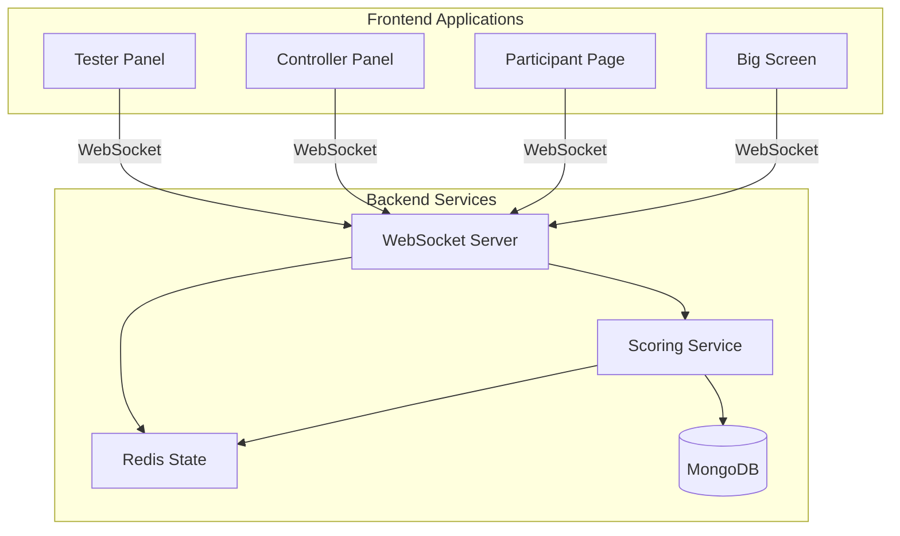
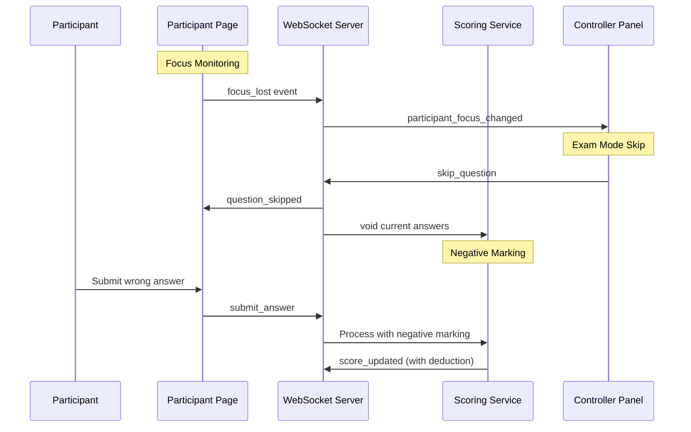

# Design Document: Quiz Platform Fixes

## Overview

This design document addresses critical bug fixes and feature additions across the CTX Quiz platform. The fixes span five major areas: Tester Panel improvements, Controller Panel exam mode features, Participant Page security and UX enhancements, Big Screen image rendering fixes, and Scoring System reliability improvements.

The design follows the existing architecture patterns established in the codebase:
- Backend: Express.js + Socket.IO with Redis for real-time state and MongoDB for persistence
- Frontend: Next.js 14 with React, Zustand for state management, and Socket.IO client
- Singleton service pattern for shared state across components

## Architecture

### System Context



### Data Flow for New Features



## Components and Interfaces

### 1. Load Tester Enhancements (Tester Panel)

#### Rate Limiting Configuration

```typescript
interface RateLimitConfig {
  /** Maximum requests per second */
  requestsPerSecond: number;
  /** Burst limit for initial joins */
  burstLimit: number;
  /** Base delay between requests in ms */
  baseDelayMs: number;
  /** Maximum retry attempts */
  maxRetries: number;
  /** Backoff multiplier for retries */
  backoffMultiplier: number;
}

interface LoadTestConfig {
  joinCode: string;
  participantCount: number;
  joinDelayMs?: number;
  simulateAnswers?: boolean;
  answerDelayMinMs?: number;
  answerDelayMaxMs?: number;
  /** New: Rate limiting configuration */
  rateLimitConfig?: RateLimitConfig;
}
```

#### Session Context Singleton

```typescript
interface SharedSessionContext {
  sessionId: string | null;
  participants: Map<number, SimulatedParticipant>;
  isActive: boolean;
  currentQuestionId: string | null;
  currentQuestionOptions: Array<{ optionId: string }> | null;
}

// Singleton pattern for shared context
class LoadTesterSingleton {
  private static instance: LoadTester | null = null;
  private static context: SharedSessionContext | null = null;
  
  static getInstance(): LoadTester;
  static getContext(): SharedSessionContext | null;
  static preserveConnections(): void;
  static restoreConnections(): void;
}
```

### 2. Controller Panel - Exam Mode

#### Skip Question Handler (Backend)

```typescript
// New WebSocket event handler in controller.handler.ts
interface SkipQuestionData {
  sessionId: string;
  reason?: string;
}

async function handleSkipQuestion(
  socket: Socket,
  data: SkipQuestionData
): Promise<void>;
```

#### Exam Mode Configuration

```typescript
interface ExamModeConfig {
  /** Skip reveal/analytics phase */
  skipRevealPhase: boolean;
  /** Enable negative marking */
  negativeMarkingEnabled: boolean;
  /** Negative marking percentage (0-100) */
  negativeMarkingPercentage: number;
  /** Enable focus monitoring */
  focusMonitoringEnabled: boolean;
  /** Auto-advance to next question */
  autoAdvance: boolean;
}

interface SessionSettings {
  // Existing fields...
  examMode?: ExamModeConfig;
}
```

### 3. Participant Page - Security & UX

#### Copy Prevention Component

```typescript
interface CopyPreventionProps {
  children: React.ReactNode;
  enabled?: boolean;
}

function CopyPrevention({ children, enabled = true }: CopyPreventionProps): JSX.Element;
```

#### Focus Monitoring Hook

```typescript
interface FocusMonitoringOptions {
  enabled: boolean;
  onFocusLost: (timestamp: number) => void;
  onFocusRegained: (timestamp: number, durationMs: number) => void;
}

interface FocusEvent {
  type: 'focus_lost' | 'focus_regained';
  timestamp: number;
  durationMs?: number;
}

function useFocusMonitoring(options: FocusMonitoringOptions): {
  isFocused: boolean;
  focusEvents: FocusEvent[];
  totalLostTime: number;
};
```

#### Answer Review Component

```typescript
interface AnswerReviewProps {
  questions: Array<{
    questionId: string;
    questionText: string;
    options: Array<{ optionId: string; optionText: string; isCorrect: boolean }>;
    participantAnswer: string[];
    correctAnswer: string[];
    pointsEarned: number;
    maxPoints: number;
    explanationText?: string;
  }>;
  totalScore: number;
  totalQuestions: number;
}

function AnswerReview(props: AnswerReviewProps): JSX.Element;
```

### 4. Big Screen - Image Fix

#### Updated RevealOptionCard

```typescript
// Fix: Use getImageUrl for option images
function RevealOptionCard({ option, ...props }: RevealOptionCardProps) {
  // Current (broken):
  // src={option.optionImageUrl}
  
  // Fixed:
  // src={getImageUrl(option.optionImageUrl) || ''}
}
```

### 5. Scoring Service - Negative Marking

#### Score Calculation with Negative Marking

```typescript
interface ScoreCalculation {
  basePoints: number;
  speedBonus: number;
  streakBonus: number;
  partialCredit: number;
  /** New: Negative marking deduction */
  negativeDeduction: number;
  totalPoints: number;
  isCorrect: boolean;
}

interface QuestionScoring {
  basePoints: number;
  speedBonusMultiplier: number;
  partialCreditEnabled: boolean;
  /** New: Negative marking settings */
  negativeMarkingEnabled: boolean;
  negativeMarkingPercentage: number;
}
```

### 6. WebSocket Events

#### New Events

```typescript
// Controller -> Server
interface SkipQuestionEvent {
  sessionId: string;
  reason?: string;
}

// Server -> All Clients
interface QuestionSkippedEvent {
  questionId: string;
  questionIndex: number;
  reason?: string;
  timestamp: number;
}

// Participant -> Server
interface FocusLostEvent {
  sessionId: string;
  participantId: string;
  timestamp: number;
}

interface FocusRegainedEvent {
  sessionId: string;
  participantId: string;
  timestamp: number;
  durationMs: number;
}

// Server -> Controller
interface ParticipantFocusChangedEvent {
  participantId: string;
  nickname: string;
  status: 'lost' | 'regained';
  timestamp: number;
  totalLostCount: number;
  totalLostTimeMs: number;
}
```

## Data Models

### Focus Tracking (Redis)

```typescript
// Redis Hash: participant:{participantId}:focus
interface ParticipantFocusData {
  lastFocusLostAt: number | null;
  totalFocusLostCount: number;
  totalFocusLostTimeMs: number;
  currentlyFocused: boolean;
}
```

### Answer History (For Review)

```typescript
// MongoDB: answers collection (existing, with additional query)
interface AnswerWithQuestion {
  answerId: string;
  sessionId: string;
  participantId: string;
  questionId: string;
  selectedOptions: string[];
  isCorrect: boolean;
  pointsAwarded: number;
  // Joined from questions
  questionText: string;
  options: Array<{ optionId: string; optionText: string; isCorrect: boolean }>;
  explanationText?: string;
}
```

### Quiz Configuration (MongoDB)

```typescript
// Extended Quiz model
interface Quiz {
  // Existing fields...
  settings: {
    // Existing settings...
    examMode?: {
      enabled: boolean;
      skipRevealPhase: boolean;
      negativeMarkingEnabled: boolean;
      negativeMarkingPercentage: number;
      focusMonitoringEnabled: boolean;
    };
  };
}
```


## Correctness Properties

*A property is a characteristic or behavior that should hold true across all valid executions of a system—essentially, a formal statement about what the system should do. Properties serve as the bridge between human-readable specifications and machine-verifiable correctness guarantees.*

### Property 1: Rate Limiting Delay Enforcement

*For any* sequence of participant join requests, the time between consecutive requests SHALL be at least the configured `baseDelayMs` value.

**Validates: Requirements 1.1**

### Property 2: Exponential Backoff on Rate Limit Errors

*For any* rate limit error received, the retry delay SHALL equal `baseDelayMs × (backoffMultiplier ^ retryAttempt)` where retryAttempt starts at 0.

**Validates: Requirements 1.2, 1.3**

### Property 3: Singleton Instance Preservation

*For any* number of calls to `LoadTesterSingleton.getInstance()`, all calls SHALL return the same instance with identical participant state.

**Validates: Requirements 2.1, 2.2, 2.3**

### Property 4: Answer Submission Format Validation

*For any* answer submission from the Load_Tester, the payload SHALL contain valid `questionId` (UUID), non-empty `selectedOptions` array, and `clientTimestamp` (positive integer).

**Validates: Requirements 3.1, 3.2**

### Property 5: Answer Statistics Tracking

*For any* answer submission (success or failure), the Load_Tester statistics SHALL be updated such that `successfulSubmissions + failedSubmissions` equals the total number of submissions attempted.

**Validates: Requirements 3.4**

### Property 6: Exam Mode State Transition

*For any* quiz session with `examMode.skipRevealPhase = true`, transitioning from ACTIVE_QUESTION SHALL go directly to the next ACTIVE_QUESTION state, never to REVEAL state.

**Validates: Requirements 4.2, 4.4**

### Property 7: Skip Question Timer Termination

*For any* skip_question event, the active timer for the current question SHALL be stopped within 100ms of receiving the event.

**Validates: Requirements 5.1**

### Property 8: Skip Question Broadcast

*For any* skip_question event processed by the server, a question_skipped event SHALL be broadcast to all connected clients (participants, controller, big screen) in the session.

**Validates: Requirements 5.3, 5.4**

### Property 9: Void Question Participant Transition

*For any* question_voided event received by a participant, if the voided question was the current active question, the participant's state SHALL transition to either the next question or a waiting state.

**Validates: Requirements 6.1, 6.2, 6.3**

### Property 10: Copy Prevention Enforcement

*For any* copy attempt (keyboard shortcut, context menu, or drag) on quiz content in the Participant_Page, the default browser action SHALL be prevented and no text SHALL be copied to clipboard.

**Validates: Requirements 7.2, 7.3, 7.4**

### Property 11: Answer Review Completeness

*For any* completed quiz, the answer review SHALL display exactly N entries where N equals the total number of questions, and each entry SHALL contain: question text, participant's answer, correct answer, points earned, and explanation (if exists).

**Validates: Requirements 8.1, 8.2, 8.3, 8.4, 8.5**

### Property 12: Focus Event Detection and Emission

*For any* visibility change detected by the browser, the Participant_Page SHALL emit either a `focus_lost` or `focus_regained` event to the server within 100ms, including the accurate timestamp.

**Validates: Requirements 9.1, 9.2, 9.3**

### Property 13: Focus Event Audit Logging

*For any* focus_lost or focus_regained event received by the server, an audit log entry SHALL be created containing sessionId, participantId, event type, and timestamp.

**Validates: Requirements 9.6**

### Property 14: Image URL Construction for Reveal Screen

*For any* option with a non-null `optionImageUrl` on the reveal screen, the rendered image `src` attribute SHALL be the result of `getImageUrl(optionImageUrl)`.

**Validates: Requirements 10.1, 10.2**

### Property 15: Score Calculation Correctness

*For any* correct answer submission, the total points awarded SHALL equal `basePoints + speedBonus + streakBonus` where:
- speedBonus = basePoints × speedBonusMultiplier × (1 - responseTimeMs / timeLimitMs)
- streakBonus = basePoints × 0.1 × (streakCount - 1) for streakCount > 1

**Validates: Requirements 11.1, 11.2, 11.3**

### Property 16: Negative Marking Calculation and Floor

*For any* incorrect answer when negative marking is enabled, the deduction SHALL equal `basePoints × negativeMarkingPercentage / 100`, and the resulting total score SHALL never be less than zero.

**Validates: Requirements 12.2, 12.3, 12.4**

### Property 17: Score Update Persistence

*For any* score calculation, the participant's score in Redis hash AND the leaderboard sorted set SHALL be updated atomically, and a score_updated event SHALL be broadcast to the participant.

**Validates: Requirements 11.4, 11.5, 11.6**

### Property 18: Scoring Error Recovery

*For any* error during score calculation, the Scoring_Service SHALL use the last valid score stored for that participant and log the error with full context.

**Validates: Requirements 13.3**

### Property 19: Answer Processing Order

*For any* participant, answers SHALL be processed in the order they were submitted (by clientTimestamp), ensuring no out-of-order score updates.

**Validates: Requirements 13.4**

## Error Handling

### Load Tester Errors

| Error Condition | Handling Strategy |
|----------------|-------------------|
| Rate limit (429) | Exponential backoff retry with max 5 attempts |
| Connection timeout | Mark participant as error, continue with others |
| Invalid join code | Fail fast, notify user immediately |
| Socket disconnect | Mark as disconnected, attempt reconnection |

### Scoring Service Errors

| Error Condition | Handling Strategy |
|----------------|-------------------|
| Redis unavailable | Use MongoDB fallback, queue for retry |
| Invalid answer format | Reject with reason, log for debugging |
| Score calculation error | Use last valid score, log full context |
| MongoDB write failure | Keep in batch, retry on next flush |

### Focus Monitoring Errors

| Error Condition | Handling Strategy |
|----------------|-------------------|
| Visibility API unsupported | Disable monitoring, log warning |
| WebSocket disconnected | Queue events locally, send on reconnect |
| Server processing error | Log error, continue monitoring |

### Image Loading Errors

| Error Condition | Handling Strategy |
|----------------|-------------------|
| Image URL invalid | Display placeholder with error icon |
| Image load timeout | Show loading state, retry once |
| Network error | Display fallback, log error |

## Testing Strategy

### Unit Tests

Unit tests focus on specific examples and edge cases:

1. **Load Tester**
   - Rate limit configuration validation
   - Backoff calculation for specific retry counts
   - Answer payload construction

2. **Scoring Service**
   - Negative marking with zero score edge case
   - Speed bonus at time boundaries (0ms, max time)
   - Streak bonus calculation for various streak lengths

3. **Focus Monitoring**
   - Visibility API event handling
   - Duration calculation accuracy
   - Event queuing when offline

4. **Copy Prevention**
   - Keyboard shortcut interception
   - Context menu prevention
   - Drag event cancellation

### Property-Based Tests

Property-based tests use **fast-check** library to verify universal properties across many generated inputs. Each test runs minimum 100 iterations.

**Test Configuration:**
```typescript
import * as fc from 'fast-check';

// Configure minimum iterations
const testConfig = { numRuns: 100 };
```

**Property Test Examples:**

```typescript
// Feature: quiz-platform-fixes, Property 1: Rate Limiting Delay Enforcement
describe('Rate Limiting', () => {
  it('should enforce minimum delay between requests', () => {
    fc.assert(
      fc.property(
        fc.integer({ min: 10, max: 1000 }), // baseDelayMs
        fc.integer({ min: 2, max: 100 }),   // participantCount
        (baseDelayMs, participantCount) => {
          // Test implementation
        }
      ),
      testConfig
    );
  });
});

// Feature: quiz-platform-fixes, Property 16: Negative Marking Calculation and Floor
describe('Negative Marking', () => {
  it('should never result in negative scores', () => {
    fc.assert(
      fc.property(
        fc.integer({ min: 0, max: 1000 }),  // currentScore
        fc.integer({ min: 10, max: 100 }),  // basePoints
        fc.integer({ min: 1, max: 100 }),   // negativePercentage
        (currentScore, basePoints, negativePercentage) => {
          const deduction = Math.floor(basePoints * negativePercentage / 100);
          const newScore = Math.max(0, currentScore - deduction);
          return newScore >= 0;
        }
      ),
      testConfig
    );
  });
});
```

### Integration Tests

1. **End-to-End Exam Mode Flow**
   - Start quiz in exam mode
   - Submit answers
   - Verify skip reveal behavior
   - Verify negative marking applied

2. **Focus Monitoring Flow**
   - Connect participant
   - Simulate visibility changes
   - Verify controller receives events
   - Verify audit log entries

3. **Load Tester Session Persistence**
   - Start load test
   - Navigate between tester pages
   - Verify connections maintained
   - Stop test and verify cleanup

### Test File Locations

```
backend/src/services/__tests__/
  scoring.service.test.ts          # Scoring properties
  scoring.service.property.test.ts # Property-based scoring tests

frontend/src/lib/__tests__/
  load-tester.test.ts              # Load tester unit tests
  load-tester.property.test.ts     # Property-based load tester tests

frontend/src/hooks/__tests__/
  useFocusMonitoring.test.ts       # Focus monitoring tests
  useCopyPrevention.test.ts        # Copy prevention tests

frontend/src/app/play/[sessionId]/components/__tests__/
  AnswerReview.test.ts             # Answer review component tests

frontend/src/app/bigscreen/[sessionId]/components/__tests__/
  reveal-screen.test.ts            # Image URL fix tests
```
