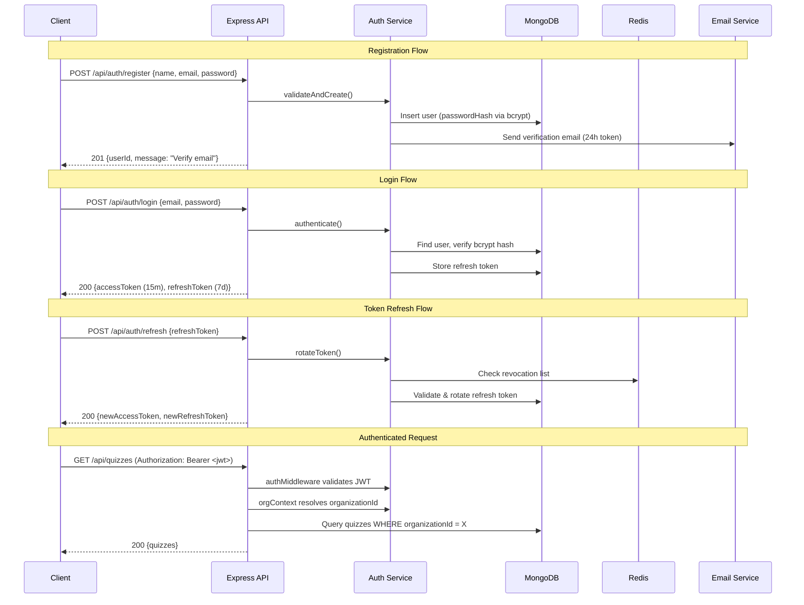
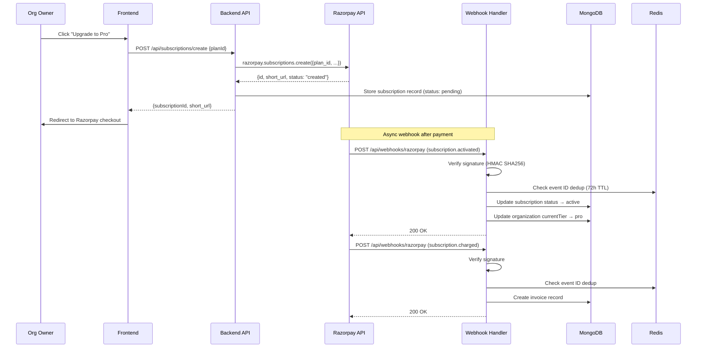

# Design Document: SaaS Conversion

## Overview

This design converts CTX Quiz from a single-tenant live quiz platform into a multi-tenant SaaS product. The conversion adds six major subsystems on top of the existing Express + MongoDB + Redis + Socket.IO stack:

1. A public landing page at ctx.works (Next.js)
2. A JWT-based authentication system with email verification and password reset
3. Role-based access control (Admin, Owner, Member) with organization-scoped permissions
4. Organization-based multi-tenancy with data isolation at the middleware layer
5. Tiered pricing (Free, Pro, Enterprise) with Redis-backed usage tracking and enforcement
6. Razorpay payment gateway integration for subscription billing, webhooks, and invoicing

The design preserves full backward compatibility with the existing participant WebSocket flow (join code → JWT → Socket.IO) while layering authenticated user sessions on top for dashboard, admin, and controller roles.

### Key Design Decisions

- **Auth tokens**: Short-lived JWT access tokens (15 min) + long-lived refresh tokens (7 days) stored in MongoDB with a Redis revocation list. This balances security with UX.
- **Tenant isolation**: A single `organizationContext` Express middleware injects `organizationId` into every request and filters all DB queries. No route handler ever sees cross-tenant data.
- **Usage enforcement**: Redis counters with calendar-month TTLs for session counts; Redis sets for active participant counts. Checked at session-create and participant-join time — the two hot paths.
- **Razorpay integration**: Server-side subscription creation via the official `razorpay` npm package. Webhook-driven status updates (no polling). Idempotent processing via Redis event ID dedup.
- **Landing page**: Static Next.js page at the root route, using the existing neumorphic design system. No new dependencies.

---

## Architecture

### High-Level System Architecture

```mermaid
graph TB
    subgraph "Frontend (Next.js 14)"
        LP[Landing Page]
        AUTH_UI[Auth Pages<br/>Login / Register / Reset]
        DASH[Dashboard<br/>Org Mgmt / Billing / Usage]
        EXISTING_UI[Existing UI<br/>Admin / Controller / Play]
    end

    subgraph "Backend (Express + Socket.IO)"
        subgraph "Middleware Chain"
            CORS[CORS]
            RL[Rate Limiter]
            AUTH_MW[Auth Middleware<br/>JWT Validation]
            ORG_CTX[Organization Context<br/>Tenant Isolation]
            USAGE_MW[Usage Guard<br/>Limit Enforcement]
        end

        subgraph "New Route Groups"
            AUTH_R[/api/auth/*]
            ORG_R[/api/organizations/*]
            SUB_R[/api/subscriptions/*]
            BILLING_R[/api/billing/*]
            WEBHOOK_R[/api/webhooks/razorpay]
        end

        subgraph "Existing Route Groups"
            QUIZ_R[/api/quizzes]
            SESSION_R[/api/sessions]
            UPLOAD_R[/api/upload]
        end

        subgraph "New Services"
            AUTH_SVC[Auth Service]
            ORG_SVC[Organization Service]
            SUB_SVC[Subscription Service]
            USAGE_SVC[Usage Tracker Service]
            RAZORPAY_SVC[Razorpay Service]
            EMAIL_SVC[Email Service]
        end

        subgraph "Existing Services"
            MONGO_SVC[MongoDB Service]
            REDIS_SVC[Redis Service]
            SOCKET_SVC[Socket.IO Service]
        end
    end

    subgraph "External"
        RAZORPAY_API[Razorpay API]
        SMTP[SMTP / Email Provider]
    end

    LP --> AUTH_UI
    AUTH_UI --> AUTH_R
    DASH --> ORG_R
    DASH --> SUB_R
    DASH --> BILLING_R
    EXISTING_UI --> QUIZ_R
    EXISTING_UI --> SESSION_R

    AUTH_R --> AUTH_SVC
    ORG_R --> ORG_SVC
    SUB_R --> SUB_SVC
    BILLING_R --> RAZORPAY_SVC
    WEBHOOK_R --> RAZORPAY_SVC

    AUTH_SVC --> MONGO_SVC
    AUTH_SVC --> REDIS_SVC
    AUTH_SVC --> EMAIL_SVC
    ORG_SVC --> MONGO_SVC
    SUB_SVC --> MONGO_SVC
    SUB_SVC --> REDIS_SVC
    USAGE_SVC --> REDIS_SVC
    RAZORPAY_SVC --> RAZORPAY_API
    RAZORPAY_SVC --> MONGO_SVC
    EMAIL_SVC --> SMTP

    QUIZ_R --> ORG_CTX
    SESSION_R --> ORG_CTX
    SESSION_R --> USAGE_MW
```

### Authentication Flow



### Razorpay Subscription Flow



---

## Components and Interfaces

### New Backend Services

#### 1. Auth Service (`backend/src/services/auth.service.ts`)

Handles user registration, login, token management, email verification, and password reset.

```typescript
interface AuthService {
  register(name: string, email: string, password: string): Promise<{ userId: string }>;
  login(email: string, password: string): Promise<{ accessToken: string; refreshToken: string }>;
  refreshToken(refreshToken: string): Promise<{ accessToken: string; refreshToken: string }>;
  logout(refreshToken: string): Promise<void>;
  verifyEmail(token: string): Promise<void>;
  resendVerification(email: string): Promise<void>;
  requestPasswordReset(email: string): Promise<void>;
  resetPassword(token: string, newPassword: string): Promise<void>;
  getUserById(userId: string): Promise<User | null>;
}
```

#### 2. Organization Service (`backend/src/services/organization.service.ts`)

Manages organization CRUD, member invitations, and role assignments.

```typescript
interface OrganizationService {
  create(userId: string, name: string): Promise<Organization>;
  update(orgId: string, updates: Partial<Organization>): Promise<Organization>;
  getById(orgId: string): Promise<Organization | null>;
  getBySlug(slug: string): Promise<Organization | null>;
  getUserOrganizations(userId: string): Promise<OrganizationMembership[]>;
  inviteMember(orgId: string, email: string, role: OrgRole, invitedBy: string): Promise<void>;
  acceptInvitation(token: string, userId: string): Promise<void>;
  removeMember(orgId: string, userId: string): Promise<void>;
  updateMemberRole(orgId: string, userId: string, role: OrgRole): Promise<void>;
  getMembers(orgId: string): Promise<OrganizationMember[]>;
}
```

#### 3. Subscription Service (`backend/src/services/subscription.service.ts`)

Manages pricing tiers, plan changes, and coordinates with Razorpay service.

```typescript
interface SubscriptionService {
  getTierDefinitions(): PricingTier[];
  getOrganizationTier(orgId: string): Promise<PricingTier>;
  getUsageStats(orgId: string): Promise<UsageStats>;
  schedulePlanChange(orgId: string, newTier: string, effective: 'immediate' | 'end_of_period'): Promise<void>;
  applyScheduledDowngrades(): Promise<void>; // cron-like, called periodically
}
```

#### 4. Usage Tracker Service (`backend/src/services/usage-tracker.service.ts`)

Redis-backed usage counting and limit enforcement.

```typescript
interface UsageTrackerService {
  checkSessionLimit(orgId: string): Promise<{ allowed: boolean; current: number; limit: number }>;
  incrementSessionCount(orgId: string): Promise<number>;
  checkParticipantLimit(orgId: string, sessionId: string): Promise<{ allowed: boolean; current: number; limit: number }>;
  incrementParticipantCount(sessionId: string): Promise<number>;
  decrementParticipantCount(sessionId: string): Promise<number>;
  getUsageStats(orgId: string): Promise<{ sessionsUsed: number; sessionsLimit: number; activeParticipants: number; participantLimit: number }>;
  applyNewLimits(orgId: string, tier: PricingTier): Promise<void>;
}
```

#### 5. Razorpay Service (`backend/src/services/razorpay.service.ts`)

Wraps the official `razorpay` npm package for subscription lifecycle and webhook processing.

```typescript
interface RazorpayService {
  createSubscription(orgId: string, planId: string, ownerEmail: string): Promise<{ subscriptionId: string; shortUrl: string }>;
  cancelSubscription(razorpaySubscriptionId: string): Promise<void>;
  updateSubscription(razorpaySubscriptionId: string, newPlanId: string): Promise<void>;
  verifyWebhookSignature(body: string, signature: string): boolean;
  handleWebhookEvent(event: RazorpayWebhookEvent): Promise<void>;
  getInvoices(orgId: string): Promise<Invoice[]>;
  getInvoiceDownloadUrl(invoiceId: string): Promise<string>;
}
```

#### 6. Email Service (`backend/src/services/email.service.ts`)

Sends transactional emails (verification, password reset, invitations, payment notifications). Uses nodemailer with SMTP transport.

```typescript
interface EmailService {
  sendVerificationEmail(email: string, token: string, name: string): Promise<void>;
  sendPasswordResetEmail(email: string, token: string): Promise<void>;
  sendInvitationEmail(email: string, orgName: string, inviterName: string, token: string): Promise<void>;
  sendPaymentFailedEmail(email: string, orgName: string, reason: string): Promise<void>;
}
```

### New Middleware

#### 1. Auth Middleware (`backend/src/middleware/auth.ts`)

Validates JWT access tokens on protected routes. Attaches `req.user` with decoded claims.

```typescript
// Attaches to req:
interface AuthenticatedRequest extends Request {
  user: {
    userId: string;
    email: string;
    memberships: Array<{ organizationId: string; role: OrgRole }>;
  };
}
```

#### 2. Organization Context Middleware (`backend/src/middleware/organization-context.ts`)

Resolves the target organization from `x-organization-id` header or JWT default org. Verifies membership. Attaches `req.organization`.

```typescript
interface OrganizationContextRequest extends AuthenticatedRequest {
  organization: {
    organizationId: string;
    role: OrgRole;
    tier: string;
  };
}
```

#### 3. Role Guard Middleware (`backend/src/middleware/role-guard.ts`)

Factory middleware that checks the user's role within the current organization.

```typescript
function requireRole(...roles: OrgRole[]): RequestHandler;
// Usage: router.put('/settings', requireRole('owner', 'admin'), handler);
```

#### 4. Usage Guard Middleware (`backend/src/middleware/usage-guard.ts`)

Checks usage limits before session creation and participant join.

```typescript
function checkSessionLimit(): RequestHandler;
function checkParticipantLimit(): RequestHandler;
```

### New API Routes

#### Auth Routes (`/api/auth`)

| Method | Path | Auth | Description |
|--------|------|------|-------------|
| POST | `/api/auth/register` | Public | Register new user |
| POST | `/api/auth/login` | Public | Login, get tokens |
| POST | `/api/auth/refresh` | Public | Refresh access token |
| POST | `/api/auth/logout` | Bearer | Invalidate refresh token |
| GET | `/api/auth/verify-email/:token` | Public | Verify email address |
| POST | `/api/auth/resend-verification` | Public | Resend verification email |
| POST | `/api/auth/forgot-password` | Public | Request password reset |
| POST | `/api/auth/reset-password` | Public | Reset password with token |
| GET | `/api/auth/me` | Bearer | Get current user profile |

#### Organization Routes (`/api/organizations`)

| Method | Path | Auth | Role | Description |
|--------|------|------|------|-------------|
| POST | `/api/organizations` | Bearer | Any | Create organization |
| GET | `/api/organizations` | Bearer | Any | List user's organizations |
| GET | `/api/organizations/:orgId` | Bearer | Member+ | Get organization details |
| PUT | `/api/organizations/:orgId` | Bearer | Owner+ | Update organization |
| POST | `/api/organizations/:orgId/invite` | Bearer | Owner+ | Invite member |
| GET | `/api/organizations/:orgId/members` | Bearer | Member+ | List members |
| PUT | `/api/organizations/:orgId/members/:userId` | Bearer | Owner+ | Update member role |
| DELETE | `/api/organizations/:orgId/members/:userId` | Bearer | Owner+ | Remove member |
| GET | `/api/organizations/invitations/:token` | Public | — | Accept invitation |

#### Subscription Routes (`/api/subscriptions`)

| Method | Path | Auth | Role | Description |
|--------|------|------|------|-------------|
| GET | `/api/subscriptions/tiers` | Public | — | List pricing tiers |
| GET | `/api/subscriptions/current` | Bearer+Org | Member+ | Get current subscription |
| POST | `/api/subscriptions/create` | Bearer+Org | Owner+ | Create Razorpay subscription |
| POST | `/api/subscriptions/upgrade` | Bearer+Org | Owner+ | Upgrade plan |
| POST | `/api/subscriptions/downgrade` | Bearer+Org | Owner+ | Schedule downgrade |
| POST | `/api/subscriptions/cancel` | Bearer+Org | Owner+ | Cancel subscription |
| GET | `/api/subscriptions/usage` | Bearer+Org | Member+ | Get usage stats |

#### Billing Routes (`/api/billing`)

| Method | Path | Auth | Role | Description |
|--------|------|------|------|-------------|
| GET | `/api/billing/invoices` | Bearer+Org | Owner+ | List invoices |
| GET | `/api/billing/invoices/:invoiceId/download` | Bearer+Org | Owner+ | Download invoice PDF |

#### Webhook Routes (`/api/webhooks`)

| Method | Path | Auth | Description |
|--------|------|------|-------------|
| POST | `/api/webhooks/razorpay` | Razorpay Signature | Handle Razorpay webhooks |

### Modified Existing Routes

The following existing routes gain the auth + org context middleware chain:

- `POST /api/quizzes` — now requires auth + org context; adds `organizationId` to quiz
- `GET /api/quizzes` — now scoped to current organization
- `POST /api/sessions` — now requires auth + org context + usage guard (session limit check)
- `POST /api/sessions/join` — now includes usage guard (participant limit check)
- `GET /api/sessions` — now scoped to current organization

### Frontend Pages

#### New Pages

| Route | Page | Description |
|-------|------|-------------|
| `/` | Landing Page | Hero, features, pricing, testimonials, footer |
| `/auth/login` | Login | Email + password login form |
| `/auth/register` | Register | Registration form with optional tier pre-selection |
| `/auth/verify-email` | Email Verification | Verification status page |
| `/auth/forgot-password` | Forgot Password | Password reset request form |
| `/auth/reset-password` | Reset Password | New password form (with token) |
| `/dashboard` | Dashboard Home | Org overview, usage, subscription card |
| `/dashboard/members` | Members | Member list, invite, role management |
| `/dashboard/settings` | Org Settings | Name, description, logo update |
| `/dashboard/billing` | Billing | Subscription management, invoices, usage history |

#### New Frontend Stores (Zustand)

- `useAuthStore` — user session, tokens, login/logout actions
- `useOrganizationStore` — current org context, org list, switcher state
- `useSubscriptionStore` — current tier, usage stats, billing data

#### New Frontend Libraries

- `frontend/src/lib/auth-client.ts` — API client methods for auth endpoints
- `frontend/src/lib/org-client.ts` — API client methods for organization endpoints
- `frontend/src/lib/billing-client.ts` — API client methods for subscription/billing endpoints

### Middleware Chain Order

For protected routes, the middleware executes in this order:

```
Request → CORS → Rate Limiter → Auth Middleware → Org Context → Role Guard → Usage Guard → Route Handler
```

For public routes (landing page, auth endpoints, webhook):

```
Request → CORS → Rate Limiter → Route Handler
```

For the existing participant join flow (backward compatible):

```
Request → CORS → Rate Limiter → Usage Guard (participant limit) → Route Handler
```

---

## Data Models

### New Collections

#### `users` Collection

```typescript
interface User {
  _id?: ObjectId;
  userId: string;           // UUID
  name: string;             // 2-100 chars
  email: string;            // unique, lowercase
  passwordHash: string;     // bcrypt, cost factor 12
  emailVerified: boolean;   // default false
  emailVerificationToken?: string;
  emailVerificationExpiry?: Date;
  passwordResetToken?: string;
  passwordResetExpiry?: Date;
  failedLoginAttempts: number;  // reset on success
  accountLockedUntil?: Date;    // set after 5 failures
  createdAt: Date;
  updatedAt: Date;
}
// Indexes: { email: 1 } unique, { userId: 1 } unique
```

#### `organizations` Collection

```typescript
interface Organization {
  _id?: ObjectId;
  organizationId: string;   // UUID
  name: string;             // 2-100 chars
  slug: string;             // unique, derived from name
  description?: string;
  logoUrl?: string;
  ownerId: string;          // userId of creator
  currentTier: 'free' | 'pro' | 'enterprise';
  subscriptionId?: string;  // references subscriptions collection
  createdAt: Date;
  updatedAt: Date;
}
// Indexes: { organizationId: 1 } unique, { slug: 1 } unique, { ownerId: 1 }
```

#### `organization_members` Collection

```typescript
interface OrganizationMember {
  _id?: ObjectId;
  organizationId: string;   // references organizations
  userId: string;           // references users
  role: 'owner' | 'member'; // org-level role
  invitedBy?: string;       // userId who invited
  joinedAt: Date;
}
// Indexes: { organizationId: 1, userId: 1 } unique compound, { userId: 1 }
```

#### `invitations` Collection

```typescript
interface Invitation {
  _id?: ObjectId;
  token: string;            // UUID, unique
  organizationId: string;
  email: string;
  role: 'owner' | 'member';
  invitedBy: string;        // userId
  expiresAt: Date;          // 7 days from creation
  acceptedAt?: Date;
  createdAt: Date;
}
// Indexes: { token: 1 } unique, { email: 1, organizationId: 1 }, { expiresAt: 1 } TTL
```

#### `refresh_tokens` Collection

```typescript
interface RefreshToken {
  _id?: ObjectId;
  token: string;            // hashed token
  userId: string;
  expiresAt: Date;          // 7 days
  createdAt: Date;
  revokedAt?: Date;
}
// Indexes: { token: 1 } unique, { userId: 1 }, { expiresAt: 1 } TTL
```

#### `subscriptions` Collection

```typescript
interface Subscription {
  _id?: ObjectId;
  organizationId: string;
  razorpaySubscriptionId: string;
  planId: string;           // Razorpay plan ID
  tierName: 'pro' | 'enterprise';
  status: 'pending' | 'active' | 'cancelled' | 'payment_failed';
  pendingDowngradeTier?: string;  // scheduled downgrade target
  currentPeriodStart?: Date;
  currentPeriodEnd?: Date;
  createdAt: Date;
  updatedAt: Date;
}
// Indexes: { organizationId: 1 }, { razorpaySubscriptionId: 1 } unique
```

#### `invoices` Collection

```typescript
interface Invoice {
  _id?: ObjectId;
  invoiceId: string;        // UUID
  organizationId: string;
  razorpayPaymentId: string;
  razorpayInvoiceId?: string;
  amount: number;           // in paise (INR smallest unit)
  currency: string;         // "INR"
  planName: string;
  billingPeriodStart: Date;
  billingPeriodEnd: Date;
  status: 'paid' | 'failed';
  createdAt: Date;
}
// Indexes: { organizationId: 1, createdAt: -1 }, { invoiceId: 1 } unique
```

#### `pricing_tiers` Collection

```typescript
interface PricingTier {
  _id?: ObjectId;
  name: 'free' | 'pro' | 'enterprise';
  displayName: string;
  participantLimit: number;     // 10, 100, 500
  sessionLimitPerMonth: number; // 3, -1 (unlimited), -1
  brandingAllowed: boolean;
  prioritySupport: boolean;
  monthlyPriceINR: number;     // in paise: 0, 99900, 499900
  razorpayPlanId?: string;     // Razorpay plan ID for paid tiers
  features: string[];          // display feature list
}
// Indexes: { name: 1 } unique
```

### Modified Existing Collections

#### `quizzes` — Add `organizationId`

```typescript
// New field added:
organizationId: string;  // references organizations
// New index: { organizationId: 1, createdAt: -1 }
```

#### `sessions` — Add `organizationId`

```typescript
// New field added:
organizationId: string;  // inherited from parent quiz
// New index: { organizationId: 1, createdAt: -1 }
```

### Redis Key Patterns (New)

| Key Pattern | Type | TTL | Purpose |
|-------------|------|-----|---------|
| `auth:revoked:{tokenHash}` | String | Remaining token lifetime | Refresh token revocation |
| `auth:login_attempts:{email}` | String (counter) | 15 min | Failed login tracking |
| `auth:verification_resend:{email}` | String (counter) | 1 hour | Rate limit verification resends |
| `auth:password_reset:{email}` | String (counter) | 1 hour | Rate limit password resets |
| `org:{orgId}:sessions_month:{YYYY-MM}` | String (counter) | End of month | Monthly session count |
| `session:{sessionId}:participant_count` | String (counter) | Session TTL | Active participant count |
| `webhook:razorpay:{eventId}` | String | 72 hours | Webhook dedup |

---

## Correctness Properties

*A property is a characteristic or behavior that should hold true across all valid executions of a system — essentially, a formal statement about what the system should do. Properties serve as the bridge between human-readable specifications and machine-verifiable correctness guarantees.*

### Property 1: Password complexity validation

*For any* string, the password validation function SHALL accept it if and only if it is at least 8 characters long and contains at least one uppercase letter, one lowercase letter, and one digit. The rejection response SHALL list exactly the unmet requirements.

**Validates: Requirements 3.3, 3.4**

### Property 2: Registration uniqueness and hash correctness

*For any* valid registration input (name, email, password), if the email does not already exist, the system SHALL create a user whose stored `passwordHash` is a valid bcrypt hash (cost factor 12) that verifies against the original password. If the email already exists, the system SHALL return a 409 Conflict error.

**Validates: Requirements 3.1, 3.2**

### Property 3: Unverified user cannot login

*For any* user whose `emailVerified` field is `false`, attempting to login with correct credentials SHALL return a 403 Forbidden error.

**Validates: Requirements 4.4**

### Property 4: Login token structure and claims

*For any* verified user with N organization memberships, a successful login SHALL return a JWT access token with a 15-minute expiry and a refresh token with a 7-day expiry. The decoded JWT payload SHALL contain the user's `userId`, `email`, and exactly those N organization memberships with their correct roles.

**Validates: Requirements 5.1, 5.7**

### Property 5: Wrong password rejection

*For any* user and any password that does not match the stored hash, login SHALL return a 401 Unauthorized error.

**Validates: Requirements 5.2**

### Property 6: Refresh token rotation

*For any* valid, non-revoked refresh token, presenting it to the refresh endpoint SHALL return a new access token and a new refresh token, and the original refresh token SHALL be invalidated (rejected on subsequent use).

**Validates: Requirements 5.4**

### Property 7: Logout invalidation

*For any* authenticated user session, after calling logout, the refresh token used in that session SHALL be rejected on any subsequent refresh attempt.

**Validates: Requirements 5.6**

### Property 8: Anti-enumeration on password reset

*For any* email string (whether registered or not), the password reset request endpoint SHALL return a 200 OK response with an identical message body, preventing email enumeration.

**Validates: Requirements 6.2**

### Property 9: Organization creation invariants

*For any* verified user and any valid organization name (2–100 characters), creating an organization SHALL produce a record with a unique slug derived from the name, the creator assigned as `owner` role, and `currentTier` set to `free`.

**Validates: Requirements 7.2, 8.1, 8.2**

### Property 10: Slug collision resolution

*For any* two organizations created with names that produce the same slug, the system SHALL ensure both slugs are unique by appending a numeric suffix to the second one.

**Validates: Requirements 8.3**

### Property 11: Organization update round-trip

*For any* valid organization update (name, description, logoUrl), reading the organization after the update SHALL return the updated values.

**Validates: Requirements 8.4**

### Property 12: Role-based access control enforcement

*For any* user and any organization, the system SHALL grant or deny access to operations based on the user's role: a `member` SHALL be able to access quizzes, sessions, and analytics but SHALL be denied access to organization settings, billing, and member management. An `owner` SHALL have access to all member capabilities plus organization settings, billing, and member management. An `admin` SHALL have access to all organizations.

**Validates: Requirements 7.3, 7.4, 7.5, 7.6**

### Property 13: Membership changes reflected in JWT

*For any* organization member whose role is changed or who is removed from an organization, the next token refresh SHALL produce a JWT whose memberships list reflects the current state (updated role or absence of the organization).

**Validates: Requirements 9.5, 9.6**

### Property 14: Last owner protection

*For any* organization with exactly one owner, attempting to remove that owner or demote them to member SHALL fail with an error.

**Validates: Requirements 9.7**

### Property 15: Tenant isolation

*For any* authenticated user and any API request targeting a resource, the system SHALL return the resource only if it belongs to an organization the user is a member of. If the resource belongs to a different organization, the system SHALL return a 403 Forbidden error. All database queries for quizzes, sessions, participants, and answers SHALL include an `organizationId` filter matching the authenticated organization context.

**Validates: Requirements 10.1, 10.2, 10.3**

### Property 16: Usage counter correctness

*For any* organization, incrementing the monthly session counter SHALL increase it by exactly 1 and the Redis key SHALL have a TTL expiring at the end of the current calendar month. For any session, incrementing the participant counter SHALL increase it by exactly 1.

**Validates: Requirements 11.4, 11.5**

### Property 17: Session limit enforcement

*For any* organization whose monthly session count equals or exceeds its pricing tier's session limit, attempting to create a new session SHALL return a 402 Payment Required error.

**Validates: Requirements 12.1, 12.2**

### Property 18: Participant limit enforcement

*For any* session whose active participant count equals or exceeds the organization's pricing tier participant limit, attempting to join SHALL return a 402 Payment Required error.

**Validates: Requirements 12.3, 12.4**

### Property 19: Feature gate enforcement

*For any* organization on a pricing tier that does not allow custom branding, attempting to set custom branding on a quiz SHALL return a 402 Payment Required error.

**Validates: Requirements 12.5**

### Property 20: Tier change preserves usage counters

*For any* organization with existing usage counters, when the pricing tier changes, the usage counts SHALL remain unchanged but the enforced limits SHALL reflect the new tier's values.

**Validates: Requirements 12.6**

### Property 21: Webhook signature verification

*For any* webhook payload and secret, a correctly computed HMAC-SHA256 signature SHALL pass verification, and any payload or signature that has been modified SHALL fail verification.

**Validates: Requirements 14.1**

### Property 22: Webhook idempotency

*For any* Razorpay webhook event, processing it N times (N ≥ 1) SHALL produce the same database state as processing it exactly once.

**Validates: Requirements 14.7**

### Property 23: Graceful degradation on downgrade

*For any* organization whose current usage exceeds the limits of a newly applied lower tier, existing active sessions SHALL continue to function, but creating new sessions SHALL be blocked until usage falls within the new limits.

**Validates: Requirements 15.5**

### Property 24: Usage threshold indicators

*For any* usage value and limit, when usage is at or above 80% but below 100% of the limit, the system SHALL indicate a warning state. When usage equals or exceeds 100% of the limit, the system SHALL indicate an error state.

**Validates: Requirements 18.3, 18.4**

### Property 25: Auth middleware JWT validation

*For any* HTTP request with an `Authorization: Bearer <token>` header, the auth middleware SHALL attach the decoded user context to the request if the token is valid and not expired, and SHALL return a 401 Unauthorized error otherwise.

**Validates: Requirements 19.1**

### Property 26: Backward compatibility with participant JWT

*For any* valid participant JWT containing `participantId`, `sessionId`, and `nickname` fields (the existing socket-auth format), the extended socket-auth middleware SHALL continue to authenticate the connection successfully and attach the participant data to `socket.data`.

**Validates: Requirements 19.5**

---

## Error Handling

### Authentication Errors

| Scenario | Status | Error Code | User Message |
|----------|--------|------------|--------------|
| Invalid registration input | 400 | `INVALID_INPUT` | Specific validation errors |
| Duplicate email | 409 | `EMAIL_EXISTS` | "Email already registered" |
| Unverified email login | 403 | `EMAIL_NOT_VERIFIED` | "Please verify your email before logging in" |
| Wrong credentials | 401 | `INVALID_CREDENTIALS` | "Invalid email or password" |
| Account locked | 429 | `ACCOUNT_LOCKED` | "Account locked. Try again in {minutes} minutes" |
| Expired/invalid JWT | 401 | `TOKEN_INVALID` | "Token expired or invalid" |
| Expired verification token | 400 | `TOKEN_EXPIRED` | "Verification token expired" |
| Expired reset token | 400 | `TOKEN_EXPIRED` | "Reset token expired" |
| Verification resend rate limit | 429 | `RATE_LIMITED` | "Too many requests. Try again later" |

### Authorization Errors

| Scenario | Status | Error Code | User Message |
|----------|--------|------------|--------------|
| Not a member of org | 403 | `FORBIDDEN` | "You do not have access to this organization" |
| Insufficient role | 403 | `INSUFFICIENT_ROLE` | "You do not have permission to perform this action" |
| Cross-tenant access | 403 | `FORBIDDEN` | "You do not have access to this resource" |
| Last owner removal | 400 | `LAST_OWNER` | "Cannot remove the last owner of an organization" |
| Max org limit | 400 | `ORG_LIMIT_REACHED` | "Maximum organization limit reached" |

### Usage & Billing Errors

| Scenario | Status | Error Code | User Message |
|----------|--------|------------|--------------|
| Session limit reached | 402 | `SESSION_LIMIT` | "Monthly session limit reached. Please upgrade your plan." |
| Participant limit reached | 402 | `PARTICIPANT_LIMIT` | "Participant limit reached for this session. Please upgrade your plan." |
| Branding not allowed | 402 | `FEATURE_GATED` | "Custom branding requires a Pro or Enterprise plan" |
| Razorpay API error | 502 | `PAYMENT_SERVICE_ERROR` | "Payment service temporarily unavailable. Please try again." |
| Invalid webhook signature | 400 | `INVALID_SIGNATURE` | (logged, not user-facing) |

### Error Response Format

All error responses follow the existing pattern:

```json
{
  "success": false,
  "error": "ERROR_CODE",
  "message": "User-friendly message"
}
```

Sensitive details (stack traces, DB errors, internal paths) are stripped using the existing `errorSanitizationService` before sending to clients.

---

## Testing Strategy

### Property-Based Tests (fast-check)

Each correctness property maps to a property-based test with minimum 100 iterations. Tests use the `fast-check` library already present in both `backend/package.json` and `frontend/package.json`.

**Backend property tests** (`backend/src/services/__tests__/`):

| Test File | Properties Covered |
|-----------|-------------------|
| `auth-password.property.test.ts` | Property 1 (password complexity) |
| `auth-registration.property.test.ts` | Property 2 (registration uniqueness + hash) |
| `auth-login.property.test.ts` | Properties 3, 4, 5 (unverified, token structure, wrong password) |
| `auth-token.property.test.ts` | Properties 6, 7 (refresh rotation, logout) |
| `auth-reset.property.test.ts` | Property 8 (anti-enumeration) |
| `organization.property.test.ts` | Properties 9, 10, 11 (creation, slug, update) |
| `rbac.property.test.ts` | Property 12 (role-based access) |
| `membership.property.test.ts` | Properties 13, 14 (JWT reflection, last owner) |
| `tenant-isolation.property.test.ts` | Property 15 (tenant isolation) |
| `usage-tracker.property.test.ts` | Properties 16, 17, 18, 19, 20 (counters, limits, feature gates, tier change) |
| `webhook.property.test.ts` | Properties 21, 22 (signature, idempotency) |
| `subscription.property.test.ts` | Property 23 (graceful degradation) |

**Frontend property tests** (`frontend/src/lib/__tests__/`):

| Test File | Properties Covered |
|-----------|-------------------|
| `usage-indicators.property.test.ts` | Property 24 (threshold indicators) |

**Middleware property tests** (`backend/src/middleware/__tests__/`):

| Test File | Properties Covered |
|-----------|-------------------|
| `auth-middleware.property.test.ts` | Property 25 (JWT validation) |
| `socket-auth-compat.property.test.ts` | Property 26 (backward compatibility) |

**Tag format**: Each test is tagged with a comment:
```typescript
// Feature: saas-conversion, Property 1: Password complexity validation
```

### Unit Tests (Jest)

Unit tests cover specific examples, edge cases, and integration points not suitable for PBT:

- Email verification flow (create → verify → login)
- Password reset flow (request → reset → login with new password)
- Account lockout after 5 failed attempts
- Rate limiting thresholds (verification resend, password reset)
- Invitation flow (invite → accept for registered/unregistered users)
- Razorpay webhook event handlers (subscription.activated, subscription.charged, subscription.cancelled, payment.failed)
- Landing page component rendering (hero, features, pricing, testimonials, footer)
- Dashboard component rendering (org overview, members, settings, billing)

### Integration Tests

- Razorpay API calls (mocked with nock or similar)
- Full auth flow: register → verify → login → refresh → logout
- Full subscription flow: create subscription → webhook activation → usage enforcement
- Tenant isolation: create 2 orgs, verify data isolation across API calls
- Middleware chain: verify correct ordering and composition

### Smoke Tests

- MongoDB collections and indexes exist after migration
- Pricing tier seed data present
- Health check endpoint returns correct status with new services
- Razorpay configuration (API keys) loaded correctly

### Test Configuration

- Property tests: minimum 100 iterations per property
- All tests run via `npm run test:backend` and `npm run test:frontend`
- Coverage target: 80%+ for new services and middleware
